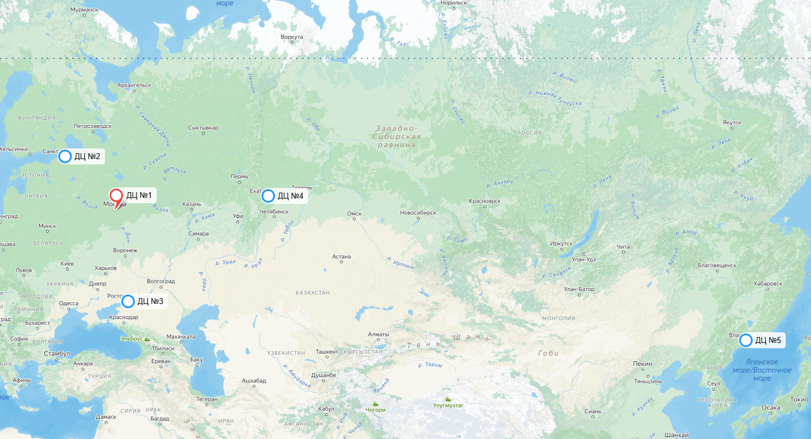

# Кинопоиск

# 1. Тема и целевая аудитория

### Тема

**Кинопоиск** – крупнейший онлайн-кинотеатр по числу пользователей в России.

### Целевая аудитория

 - Целевая аудитория - пользователи из разных социальных и возрастных групп. Это преимущественно жители крупных городов в возрасте от 25 до 34 лет[^1]
 - К концу 2023г. ежемесячная аудитория сервиса, использующая платформу в качестве онлайн-кинотеатра измерялась 9,1 млн пользователей[^2], а а к концу 2024г. возросла до 14 млн в месяц.[^3]

### Веб-трафик по странам

<em>Прим. данные согласно сайту SimilarWeb</em>[^4]

- Общее количество посещений - 190,9 млн. в мес.
- MAU - 14 млн.
- Среднее время сессии - 5 мин 6 сек
- Среднее число просмотренных страниц за одно посещение - 3,85
- Около 90% трафика сайта приходится на Россию.

### Демографические показатели

<em>Прим. данные согласно сайту SimilarWeb</em>[^4]

- 60,81% посетителей - мужчины
- Основной процент аудитори приходится на молодых людей 25-34 лет (26,65%).

### MVP функционал

- Регистрация и вход в аккаунт - Пользователи могут создать учетную запись и войти в систему с помощью почты Яндекса.  

- Каталог фильмов и сериалов - Возможность просмотра списка фильмов и сериалов, организованных по жанрам, популярности и рекомендациям.  

- Поиск и фильтрация - Удобный поиск по названию, актерам, режиссерам, а также фильтрация по жанрам, рейтингу и году выпуска.  

- Карточка видеоматериала - Описание фильма/сериала, постер, трейлер, список актеров, продолжительность, страна производства.  

- Отзывы и рейтинги - Пользователи могут оставлять рецензии и ставить оценки, формируя общий рейтинг фильма/сериала.  

- Просмотр фильмов и сериалов - Оформившие подписку пользователи могут смотреть контент в разрешение от 240p до 4К(для некоторых фильмов). 

- Список избранного - Пользователи могут добавлять фильмы в "Избранное" для быстрого доступа к ним позже.  

- Досмотр контента - Возможность продолжить просмотр с того места, где пользователь остановился.  

- Рекомендательная система - Формирование списка рекомендаций на основе просмотренных фильмов и проставленных оценок.

# 2. Расчет нагрузки

Как уже известно MAU кинопоиска составляет 14 млн. Ежедневная аудитория, согласно WebArchive[^5], составляет 2,6 млн.

| MAU  | DAU |
| ------------- | ------------- | 
| 14 млн | 2,6 млн |

## Продуктовые метрики

Всего на Кинопоиске к концу 2023г. около **11000** тайтлов[^6].

Средняя продолжительность фильма в последние годы возросла до 120-130 минут, согласно анализу данных базы IMDB[^7]. Также, одна серия одного сериала в среднем занимает 40 минут. 

Таким образом, средний размер одного файла в разрешении **4K** составляет **35 ГБ** (20 ГБ одна 40-минутная серия сериала и 50 ГБ двухчасовой фильм[^8] => (20 ГБ + 50 ГБ)/2 = 35ГБ). Это даёт:

- **Общий объём 4K контента:**
  - `11000 × 35 ГБ = 280000 ГБ = 280 ТБ = 0,385 ПБ`

Также существуют версии контента в **1080p**, **720p**, **480p** и **360p**:

- **1080p** (~1/4 от 4K): `7 ГБ × 11000 = 56 ТБ = 0,077 ПБ`
- **720p** (~1/8 от 4K): `4,4 ГБ × 11000 = 35,2 ТБ = 0,0484 ПБ`
- **480p** (~1/12 от 4K): `2,9 ГБ × 11000 = 23,2 ТБ = 0,0319 ПБ`
- **360p** (~1/18 от 4K): `1,75 ГБ × 11000 = 14 ТБ = 0,0193 ПБ`

Итоговый объем видеохранилища: **0,562 ПБ**

Далее высчитаем объем пользовательских данных
К пользовательской информации относятся имя, возраст, описание, пол, страна и город проживания, ссылки на соцсети и интересы. Данная текстовая информация занимает до нескольких килобайт. Кроме того пользователь мжет поставить аватарку на свой профиль. На странице редактирования профиля[^9] можно увидеть информацию о том, что аватар пользователя не должен превышать 2 МБ. Примем эту верхнюю оценку.
Расчитаем, насколько ужимается аватар, после её загрузки в профиль на практике.

Изначальный размер фотографии - 141Кб. После скачивания уже загруженного аватара его размер стал 6,4 Кб. Таким образом, в среднем фотография ужимается в **141/6,4 ~ 22 раза**. Тогда общий объем пользовательских данных составит:

- **Средний объём на пользователя:** ~ **2 МБ**
- **Общий объём хранения данных пользователей:**
  - `14 000 000 × 2 МБ / 22  = 1 272 727,3 МБ = 1,3 ТБ = 0,0013 ПБ`

Хранение рецензий и оценок
- **Средний вес одной рецензии:** **1 КБ** (1000 символов ASCII)
- **Общее количество рецензий:** **834 641**[^10]
- **Общий объем рецензий:**
  - `1 КБ × 834 641 = 0,8 ГБ`
- **Запас хранения + оценки:** **1 ГБ**

## Общий размер хранилища
| Компонент | Объём |
|-----------|-------|
| Видеоконтент | **0,562 ПБ** |
| Данные пользователей | **0,0013 ПБ** |
| Рецензии и оценки | **1 ГБ** |
| **ИТОГО** | **~0,563 ПБ** |

### Действия пользователя в день

Для анализа активности пользователей рассмотрим основные взаимодействия с платформой:

- **Авторизация** — в среднем **1 раз в день** (просмотр контента требует авторизации).
- **Покупка подписки** — обычно пользователь покупает подписку ежемесячно, но так же есть возможно офромить ее на 3, 6 и 12 месяцев. Примем за среднее - 3 месяца, поэтому 1/90 = значит **0,01 раз в день**.
- **Просмотр контента** — в 2024 году подписчики в среднем смотрят **34,6 тайтлов** и **11 спортивных трансляций** в год[^11]. Примем длительность спортивного события равной средней длительности одного тайтла - 2 часа. Тогда всего за год пользователь смотрит 45,6 * 2 = 91,2 часов. Это равняется 91,2*60/365 = **15 минут в день**.
- **Оценка контента** — в 2023 году пользователи оставили **180 млн оценок**, это **6 млн оценок в день**, или **~0,27 оценок на пользователя в день**.
- **Оставление рецензий** — на платформе **834 641 рецензий**, ежедневно публикуются **~400 новых**, значит **~0,000018 рецензий на пользователя в день**.
- **Поиск контента** — **4 раза в день**[^12].
- **Рекомендации** — рекомендательная система строится на основе просмотра интересующего контента и оставлении оценки, а значит перестраивается примерно 0,27 р/день + 15 мин/день **≈ 1 раз в день**.
- **Добавление в избранное** - по статистике лишь каждый 10-ый фильм пользователь добавляет в избранное, а значит 4*0,1 **~ 0,4 раза в день**
- **Досмотр контента** - в среднем пользователь заходит на главную страницу **1 раз в день**, но долистывает до списка **каждый 10**, то частота **≈ 0,1 раз в день**

### Таблица частоты действий
| Действие | Частота в день |
|----------------------|------------------|
| Авторизация | 1 |
| Покупка подписки | 0,01 |
| Поиск контента | 4 |
| Просмотр видео | 15 минут |
| Оценка контента | 0,27 |
| Оставление рецензии | 0,000018 |
| Рекомендации | 1 |
| Добавление в избранное | 0,4 |
| Досмотр контента | 0,1 |

### Прирост дискового пространства

Согласно источнику[^13], на конец 2023г, количество подписчиков Кинопоиска на конец 2023г. составляло 11,1 млн. чел. При этом, к концу 2024г. их количество возросло до 14 млн. чел. Значит прирост пользовательских данных за год составляет **(14 000 000 - 11 100 000) * 2 МБ / 22 ≈ 264 000 МБ = 0,264 ТБ**

Как уже было сказано, на Кинопоиске к концу 2023г. было **11000** тайтлов. При этом, к середине 2020г. их было около **8000**[^14]. На основании чего можно сделать вывод, что за год количество тайтлов возрастает примерно на **1000**. Как уже было вычислено, для **11000** тайтлов размер видеохранилища составляет **0,562 ПБ**. Значит прирост дискового пространства в год составит **1/11** часть: **0,562 ПБ / 11 ≈ 0,051 ПБ**

Прирост рецензий и оценок незначителен (порядка 0,5 ГБ), так что ими можно пренебречь.

| Компонент | Объём |
|-----------|-------|
| Видеоконтент | **0,051 ПБ** |
| Данные пользователей | **0,264 ТБ** |
| **ИТОГО** | **~0,0513 ПБ** |

## Технические метрики

### RPS

| Действие | Формула | RPS |
|----------------------|----------------------------|------|
| Авторизация | `1 × 2 600 000 / 86400` | **30** |
| Покупка подписки | `0,01 × 2 600 000 / 86400` | **0,3** |
| Поиск контента | `4 × 2 600 000 / 86400` | **120** |
| Просмотр видео | `(15 × 60) × 2 600 000 / (86400 * 10)` | **2708*** |
| Оценка контента | `0,27 × 2 600 000 / 86400` | **8,1** |
| Оставление рецензии | `0,000018 × 2 600 000 / 86400` | **0,0005** |
| Рекомендации | `1 × 2 600 000 / 86400` | **30** |
| Добавление в избранное | `0,4 × 2 600 000 / 86400` | **12** |
| Досмотр контента | `0,1 × 2 600 000 / 86400` | **3** |

 - `*` - деление на 10 из-за буфферизации контента - получение данных пачками по 10 секунд. 

### Сетевой трафик

Потребление трафика зависит от качества видео и активности пользователей. Большинство (90%) смотрит в разрешении до 1080p (3 Мбит/с), 10% — в 4K (20 Мбит/с). В среднем каждый пользователь смотрит 15 минут видео в день.

### Средний дневной трафик:

| Категория пользователей | Формула | Трафик в день |
|------------------------|---------------------|---------------------|
| **10% аудитории (4K)** | `(2 600 000 × 0.1 × 15 × 60 × 20) / 8` | **0,59 ПБ** |
| **90% аудитории (≤1080p)** | `(2 600 000 × 0.9 × 15 × 60 × 3) / 8` | **0,79 ПБ** |

В вечерние часы и выходные нагрузка увеличивается примерно в 3 раза.

---

### Сетевой трафик (10% аудитории, 4K)

| Действие               | Формула | Обычный (58,5 Гбит/с) | Пиковый (176 Гбит/с) |
|------------------------|---------------------------------|---------------------|---------------------|
| Просмотр видео        | `((2 600 000 × 0.1 × 15 × 60 × 20) / 8) / 86400` | 45 Гбит/с  | 135 Гбит/с |
| Регистрация/авторизация | `30 × 0.5 МБ × 8 / 10⁶` | 3 Гбит/с  | 10 Гбит/с  |
| Поиск фильма          | `120 × 1 МБ × 8 / 10⁶`  | 8 Гбит/с  | 24 Гбит/с  |
| Оставление комментария | `8 × 0.1 МБ × 8 / 10⁶`  | 5 Гбит/с  | 15 Гбит/с  |
| Подписка              | `0.3 × 5 МБ × 8 / 10⁶`  | 1 Гбит/с  | 3 Гбит/с   |
| Оценка видео          | `8.1 × 0.1 МБ × 8 / 10⁶` | 1 Гбит/с  | 3 Гбит/с   |
| Рекомендации          | `30 × 0.5 МБ × 8 / 10⁶` | 3 Гбит/с  | 10 Гбит/с  |
| Добавление в избранное | `12 × 0.1 МБ × 8 / 10⁶` | 1 Гбит/с  | 3 Гбит/с   |

---

### Сетевой трафик (90% аудитории, ≤1080p)

| Действие               | Формула | Обычный (73,5 Гбит/с) | Пиковый (223,5 Гбит/с) |
|------------------------|---------------------------------|---------------------|---------------------|
| Просмотр видео        | `((2 600 000 × 0.9 × 15 × 60 × 3) / 8) / 86400` | 60 Гбит/с  | 180 Гбит/с |
| Регистрация/авторизация | `30 × 0.5 МБ × 8 / 10⁶` | 3 Гбит/с  | 10 Гбит/с  |
| Поиск фильма          | `120 × 1 МБ × 8 / 10⁶`  | 8 Гбит/с  | 24 Гбит/с  |
| Оставление комментария | `8 × 0.1 МБ × 8 / 10⁶`  | 5 Гбит/с  | 15 Гбит/с  |
| Подписка              | `0.3 × 5 МБ × 8 / 10⁶`  | 1 Гбит/с  | 3 Гбит/с   |
| Оценка видео          | `8.1 × 0.1 МБ × 8 / 10⁶` | 1 Гбит/с  | 3 Гбит/с   |
| Рекомендации          | `30 × 0.5 МБ × 8 / 10⁶` | 3 Гбит/с  | 10 Гбит/с  |
| Добавление в избранное | `12 × 0.1 МБ × 8 / 10⁶` | 1 Гбит/с  | 3 Гбит/с   |

# 3. Глобальная балансировка нагрузки

## Разбиение по доменам

Для примера, доменное имя сервиса будет **TheWatcher.ru**. Сервис также будет доступен в доменных зонах Казахстана и Беларуси:

- **TheWatcher.kz**
- **TheWatcher.by**

Дальше приведу список допольнительных доменных имён и чем они будут заниматься.

- **m.TheWatcher.ru** - сервис для мобильных пользователей, предназначенный примерно для 25% аудитории. 75% аудитории будут пользоваться веб-версией. 
- **passport.TheWatcher.ru** - сервис аутентификации и авторизации.
- **api.TheWatcher.ru** - интеграция рекламных инструментов и платежных сервисов для оплаты подписки Яндекс.Плюс внутри сервиса
- **comments.TheWatcher.ru** - для оставления комментариев выделен отдельный домен.

## Выбор расположения дата-центров

При размещении дата-центров будем ориентироваться на плотность населения России

Ключевые дата-центры размещены в : **Москве, Санкт-Петербурге, Екатеринбурге**, так как там сосредоточена значительная часть целевой аудитории. 

Учитывая большую территорию России разместим 2 дополнительных дата центра для работы на ее территории в крупных городах. После географического анализа были выбраны следующие:

- **Ростов-на-Дону**
- **Владивосток**

## Распределение запросов по дата-центрам

### Разбиение RPS по Датацентрам

Ориентируясь на карту магистральных сетей, составим разбиение RPS по датацентрам.

|Москва (25%)|Санкт-Петербург (25%)|Ростов-на-Дону (20%)|Екатеринбург (20%)|Владивосток (10%)|
|-----|-----|-----|-----|-----|
|**727,85**|**727,85**|**582,28**|**582,28**|**291,14**|

Каждый ДЦ хранит полный объём видеоконтента сервиса, поэтому все запросы на просмотр и поиск фильмов направляются в ближайший ДЦ по географическому принципу.

### Дата-центры для авторизации, регистрации и подписки

**Города, обрабатывающие запросы на регистрацию, авторизацию и оформление подписки:**
- **Москва** (Россия)
- **Санкт-Петербург** (Россия)
- **Екатеринбург** (Россия)

Если пользователь пытается авторизоваться в городе, где нет центра обработки таких запросов, его запрос будет проксироваться в ближайший менее загруженный ДЦ из списка выше.

### Дата-центр для комментариев и оценок

**Город, обрабатывающий запросы на оставление комментариев и оценку контента:**
- **Москва** (Россия)

Ввиду необходимости строгой синхронизации данных все запросы на комментарии и оценки проходят через московский ДЦ.

Обоснование:

- Это позволяет избежать несогласованности данных при расчёте рейтингов.
- Москва имеет наиболее мощные сервера для обработки текстовых данных и аналитики.
- Все остальные ДЦ перенаправляют такие запросы в Москву.

## DNS-балансировка

Использование **Anycast DNS** позволит направлять запросы пользователей в ближайший дата-центр с минимальной задержкой (RTT), основываясь на маршрутизации сети. Это обеспечит равномерное распределение нагрузки и быструю работу сервиса.

# 4. Локальная балансировка нагрузки

## Схема балансировки

### 1. Преодоление глобальной балансировки.
После прохождения глобальной балансировки (**Anycast DNS**) клиентский запрос направляется в выбранный дата-центр. Теперь трафик нужно распределить между локальными серверами внутри ДЦ.

### 2. L4-балансировщик (VS IP tunneling)
Запрос поступает на балансировщик **четвертого уровня (L4)**, который работает на уровне **TCP/UDP**.  
Выбран **VS IP tunneling**, так как он инкапсулирует сообщения, после обработки которых **не требуется обратная передача через балансировщик**. Это **уменьшает нагрузку на балансировщик**, снижает количество лишнего трафика и улучшает производительность системы.

Также используется **CARP (Common Address Redundancy Protocol)** для отказоустойчивости. Несколько устройств объединяются в группу, одно из них становится **master**, а другие — резервными. В случае сбоя **master** передает свои функции резервному устройству. Обычно в группе используются **два балансировщика**.

Мониторинг доступности серверов осуществляется с помощью **health check-запросов** (кастомная пустая функция).  
L4-балансировщик выбирает **наименее загруженный Nginx** и передает запрос ему.

### 3. L7-балансировщик (Nginx)
Следующим этапом является **балансировка на уровне L7**.  
Выбран **Nginx**, так как он:
- **Эффективно работает с "медленными клиентами"**.
- **Кэширует** ответы серверов-источников, уменьшая нагрузку.
- **Сжимает** данные, сокращая объем передаваемой информации.
- **Защищает** от DDoS-атак, проверяет подлинность и авторизует пользователей.
- **Мониторит состояние серверов** и может автоматически переключаться на резервные при сбоях.
- **Работает с HTTPS**, расшифровывая трафик перед отправкой на backend.

После обработки запроса **Nginx проксирует его в нужный кластер Kubernetes**, определяемый по заголовку.

### 4. Kubernetes
Запрос попадает в кластер **Kubernetes (k8s)**, который управляет **разворачиванием сервисов и контейнеризацией**.

**Почему выбрал Kubernetes:**
- **Автоматическое масштабирование (auto-scaling)** — k8s сам увеличивает или уменьшает количество ресурсов в зависимости от нагрузки.
- **Гибкость и отказоустойчивость** — контейнеры автоматически перезапускаются при сбоях.
- **Изоляция сервисов** — можно разделять разные сервисы по кластерам для безопасности.

Например:
- В ДЦ **Москвы, Питера, Минска, Астаны и Екатеринбурга** развернут отдельный кластер с повышенной безопасностью для **авторизации и подписок**.
- В **московском ДЦ** выделен отдельный кластер для **комментариев и оценок**, чтобы повысить безопасность.

Kubernetes автоматически распределяет нагрузку между серверами, обеспечивая **стабильную и бесперебойную работу сервисов**.

### 5. Возвращение ответа.
После обработки запроса в Kubernetes ответ проходит **обратный путь**:
1. **Микросервис в k8s** формирует ответ.
2. **L7-балансировщик (Nginx)** принимает его, обрабатывает (например, сжимает) и передает дальше.
3. **L4-балансировщик** направляет данные клиенту.

## Список источников

[^1]: [Статья про Кинопоиск на Википеди](https://ru.wikipedia.org/wiki/%D0%9A%D0%B8%D0%BD%D0%BE%D0%BF%D0%BE%D0%B8%D1%81%D0%BA)

[^2]: [Анализ деятельности сайта от tAdviser](https://www.tadviser.ru/index.php/%D0%9A%D0%BE%D0%BC%D0%BF%D0%B0%D0%BD%D0%B8%D1%8F:%D0%9A%D0%B8%D0%BD%D0%BE%D0%BF%D0%BE%D0%B8%D1%81%D0%BA)

[^3]: [Итоги года от Кинопоиска](https://www.kinometro.ru/news/show/name/kinopoisk_itogi2024_19122024#:~:text=%D0%A1%D0%B0%D0%BC%D1%8B%D0%BC%20%D0%BF%D0%BE%D0%BF%D1%83%D0%BB%D1%8F%D1%80%D0%BD%D1%8B%D0%BC%20%D0%BF%D1%80%D0%BE%D0%B5%D0%BA%D1%82%D0%BE%D0%BC%20%D1%81%D1%82%D0%B0%D0%BB%20%D1%81%D0%B5%D1%80%D0%B8%D0%B0%D0%BB%20%C2%AB%D0%A2%D1%80%D0%B8%D0%B3%D0%B3%D0%B5%D1%80%C2%BB&text=%D0%95%D0%B6%D0%B5%D0%BC%D0%B5%D1%81%D1%8F%D1%87%D0%BD%D0%B0%D1%8F%20%D0%B0%D1%83%D0%B4%D0%B8%D1%82%D0%BE%D1%80%D0%B8%D1%8F%20%C2%AB%D0%9A%D0%B8%D0%BD%D0%BE%D0%BF%D0%BE%D0%B8%D1%81%D0%BA%D0%B0%C2%BB%20%D1%81%D0%BE%D1%81%D1%82%D0%B0%D0%B2%D0%B8%D0%BB%D0%B0%2050,%25%20%D0%B1%D0%BE%D0%BB%D1%8C%D1%88%D0%B5%20%D0%B3%D0%BE%D0%B4%20%D0%BA%20%D0%B3%D0%BE%D0%B4%D1%83)

[^4]: [Анализ трафика от SimilarWeb](https://pro.similarweb.com/#/digitalsuite/websiteanalysis/overview/website-performance/*/999/1m?webSource=Total&key=kinopoisk.ru)

[^5]: [Статистика от WebArchive](https://web.archive.org/web/20231129184042/https://radar.yandex.ru/yandex?month=2022-05)

[^6]: [Комментарий пресс-службы Кинопоиска РБК](https://www.rbc.ru/technology_and_media/16/11/2023/65548b529a7947815e93d67b)

[^7]: [Средняя продолжительность фильмов](https://www.vedomosti.ru/gorod/leisuretime/articles/barbi-oppengeimer-i-avatar-pochemu-filmi-stali-takimi-dlinnimi)

[^8]: [Вес видео в формате 4к](https://webos-forums.ru/post90619.html)

[^9]: [Страница редактирования профиля](https://www.kinopoisk.ru/mykp/edit_main/)

[^10]: [Рецензии на кинопоиске](https://www.kinopoisk.ru/reviews/)

[^11]: [Итоги 2024 года](https://habr.com/ru/news/868442/)

[^12]: [Исследование страницы персоны Кинопоиска](https://medium.com/@IngMaeSing/kinopoisk-person-page-research-4f33e5b4d318)

[^13]: [Подписчики российских онлайн-кинотеатров на конец 2023г.](https://vc.ru/media/1009380-kolichestvo-podpischikov-u-rossiiskih-onlain-kinoteatrov-na-konec-2023-goda-prevysilo-452-mln-telecomdaily)

[^14]: [Информация о подписке Яндекс.Плюс](https://www.kinopoisk.ru/media/news/4002246/)