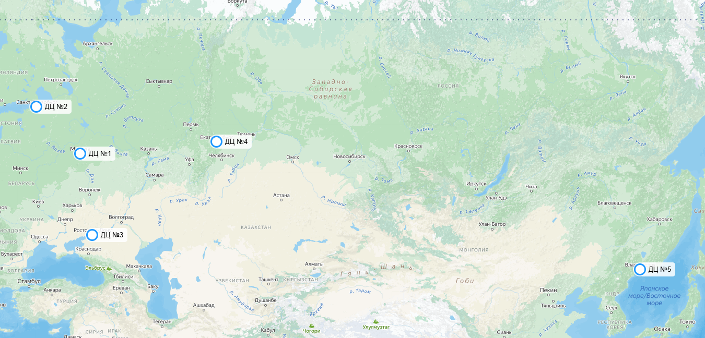
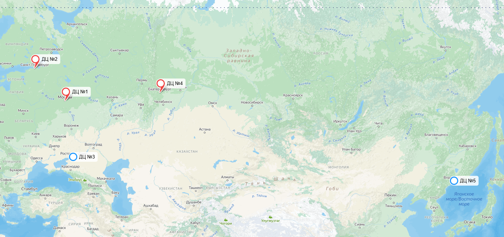
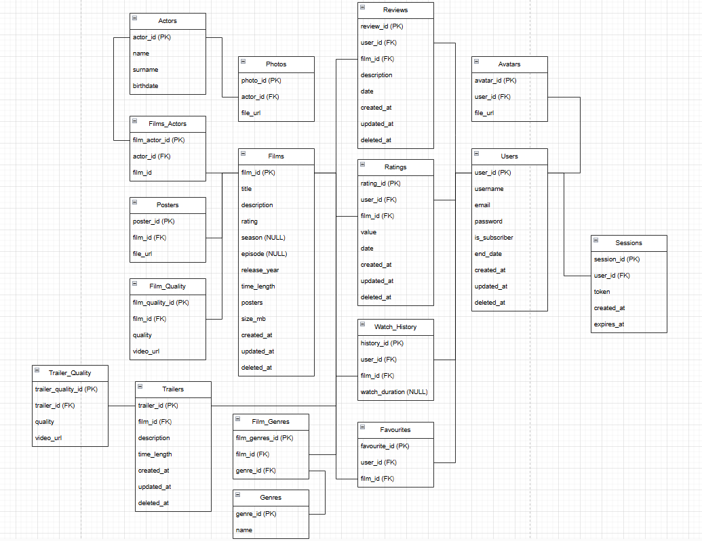
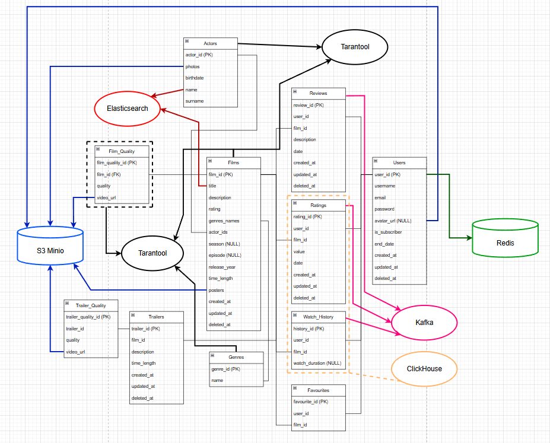

# Кинопоиск

# 1. Тема и целевая аудитория

### Тема

**Кинопоиск** – крупнейший онлайн-кинотеатр по числу пользователей в России.

### Целевая аудитория

- Целевая аудитория - пользователи из разных социальных и возрастных групп. Это преимущественно жители крупных городов в возрасте от 25 до 34 лет[^1]
- К концу 2023г. ежемесячная аудитория сервиса, использующая платформу в качестве онлайн-кинотеатра измерялась 9,1 млн пользователей[^2], а а к концу 2024г. возросла до 14 млн в месяц.[^3]

### Веб-трафик по странам

<em>Прим. данные согласно сайту SimilarWeb</em>[^4]


- Общее количество посещений - 190,9 млн. в мес.
- MAU - 14 млн.
- Среднее время сессии - 5 мин 6 сек
- Среднее число просмотренных страниц за одно посещение - 3,85
- Около 90% трафика сайта приходится на Россию.

### Демографические показатели

<em>Прим. данные согласно сайту SimilarWeb</em>[^4]


- 60,81% посетителей - мужчины
- Основной процент аудитори приходится на молодых людей 25-34 лет (26,65%).

### MVP функционал

- **Регистрация и вход в аккаунт** – пользователи могут создать учетную запись и войти в систему с помощью почты Яндекса. Авторизация требуется для просмотра контента.

- **Покупка подписки** – пользователи могут оформить подписку на 1, 3, 6 или 12 месяцев.

- **Поиск и фильтрация** – удобный поиск по названию, актерам, режиссерам, а также фильтрация по жанрам, рейтингу и году выпуска.

- **Просмотр фильмов и сериалов** – оформленные подписчики могут смотреть контент в разрешении от 240p до 4К (для некоторых фильмов).

- **Отзывы и рейтинги** – пользователи могут оставлять рецензии и ставить оценки, формируя общий рейтинг фильма/сериала.

- **Рекомендательная система** – формирование списка рекомендаций на основе просмотренных фильмов и проставленных оценок. Алгоритм обновляет рекомендации.

- **Список избранного** – пользователи могут добавлять фильмы в "Избранное" для быстрого доступа к ним позже.

- **Досмотр контента** – возможность продолжить просмотр с того места, где пользователь остановился.

# 2. Расчет нагрузки

Как уже известно MAU кинопоиска составляет 14 млн. Ежедневная аудитория, согласно WebArchive[^5], составляет 2,6 млн.

| MAU    | DAU     |
| ------ | ------- |
| 14 млн | 2,6 млн |

## Продуктовые метрики

К началу 2021г. база данных кинопоиска состояла из 817 000 фильмов и сериалов[^6]. Будем считать что к текущему моменту база выросла до 1 000 000 фильмов. При этом, к концу 2023г. лишь около **11000** тайтлов можно посмотреть[^7].

Средняя продолжительность фильма в последние годы возросла до 120-130 минут, согласно анализу данных базы IMDB[^8]. Также, одна серия одного сериала в среднем занимает 40 минут.

Таким образом, средний размер одного файла в разрешении **4K** составляет **35 ГБ** (20 ГБ одна 40-минутная серия сериала и 50 ГБ двухчасовой фильм[^9] => (20 ГБ + 50 ГБ)/2 = 35ГБ). Это даёт:

- **Общий объём 4K контента:**
  - `11000 × 35 ГБ = 280000 ГБ = 280 ТБ = 0,385 ПБ`

Также существуют версии контента в **1080p**, **720p**, **480p** и **360p**:

- **1080p** (~1/4 от 4K): `7 ГБ × 11000 = 56 ТБ = 0,077 ПБ`
- **720p** (~1/8 от 4K): `4,4 ГБ × 11000 = 35,2 ТБ = 0,0484 ПБ`
- **480p** (~1/12 от 4K): `2,9 ГБ × 11000 = 23,2 ТБ = 0,0319 ПБ`
- **360p** (~1/18 от 4K): `1,75 ГБ × 11000 = 14 ТБ = 0,0193 ПБ`

Итоговый объем видеохранилища: **0,562 ПБ**

Далее высчитаем объем пользовательских данных
К пользовательской информации относятся имя, возраст, описание, пол, страна и город проживания, ссылки на соцсети и интересы. Данная текстовая информация занимает до нескольких килобайт. Кроме того пользователь мжет поставить аватарку на свой профиль. На странице редактирования профиля[^10] можно увидеть информацию о том, что аватар пользователя не должен превышать 2 МБ. Примем эту верхнюю оценку.
Расчитаем, насколько ужимается аватар, после её загрузки в профиль на практике.


Изначальный размер фотографии - 141Кб. После скачивания уже загруженного аватара его размер стал 6,4 Кб. Таким образом, в среднем фотография ужимается в **141/6,4 ~ 22 раза**. Тогда общий объем пользовательских данных составит:

- **Верхнняя оценка объёма на пользователя:** ~ **2 МБ / 22** ≈ **0,09 Мб**
- **Общий объём хранения данных пользователей:**
  - `14 000 000 × 2 МБ / 22  = 1 272 727,3 МБ = 1,3 ТБ = 0,0013 ПБ`

Хранение рецензий и оценок

- **Средний вес одной рецензии:** **1 КБ** (1000 символов ASCII)
- **Общее количество рецензий:** **834 641**[^11]
- **Общий объем рецензий:**
  - `1 КБ × 834 641 = 0,8 ГБ`
- **Запас хранения + оценки:** **1 ГБ**

## Общий размер хранилища

| Компонент            | Объём         |
| -------------------- | ------------- |
| Видеоконтент         | **0,562 ПБ**  |
| Данные пользователей | **0,0013 ПБ** |
| Рецензии и оценки    | **1 ГБ**      |
| **ИТОГО**            | **~0,563 ПБ** |

### Действия пользователя в день

Для анализа активности пользователей рассмотрим основные взаимодействия с платформой:

- **Авторизация** — в среднем **1 раз в день** (просмотр контента требует авторизации).
- **Покупка подписки** — обычно пользователь покупает подписку ежемесячно, но так же есть возможно офромить ее на 3, 6 и 12 месяцев. Примем за среднее - 3 месяца, поэтому 1/90 = значит **0,01 раз в день**.
- **Просмотр контента** — в 2024 году подписчики в среднем смотрят **34,6 тайтлов** и **11 спортивных трансляций** в год[^12]. Примем длительность спортивного события равной средней длительности одного тайтла - 2 часа. Тогда всего за год пользователь смотрит 45,6 * 2 = 91,2 часов. Это равняется 91,2*60/365 = **15 минут в день**.
- **Оценка контента** — в 2023 году пользователи оставили **180 млн оценок**, это **6 млн оценок в день**, или **~0,27 оценок на пользователя в день**.
- **Оставление рецензий** — на платформе **834 641 рецензий**, ежедневно публикуются **~400 новых**, значит **~0,000018 рецензий на пользователя в день**.
- **Поиск контента** — **4 раза в день**[^13].
- **Рекомендации** — рекомендательная система строится на основе просмотра интересующего контента и оставлении оценки, а значит перестраивается примерно 0,27 р/день + 15 мин/день **≈ 1 раз в день**.
- **Добавление в избранное** - по статистике лишь каждый 10-ый фильм пользователь добавляет в избранное, а значит 4\*0,1 **~ 0,4 раза в день**
- **Досмотр контента** - в среднем пользователь заходит на главную страницу **1 раз в день**, но долистывает до списка **каждый 10**, то частота **≈ 0,1 раз в день**

### Таблица частоты действий

| Действие               | Частота в день |
| ---------------------- | -------------- |
| Авторизация            | 1              |
| Покупка подписки       | 0,01           |
| Поиск контента         | 4              |
| Просмотр видео         | 15 минут       |
| Оценка контента        | 0,27           |
| Оставление рецензии    | 0,000018       |
| Рекомендации           | 1              |
| Добавление в избранное | 0,4            |
| Досмотр контента       | 0,1            |

### Прирост дискового пространства

Согласно источнику[^14], на конец 2023г, количество подписчиков Кинопоиска на конец 2023г. составляло 11,1 млн. чел. При этом, к концу 2024г. их количество возросло до 14 млн. чел. Значит прирост пользовательских данных за год составляет **(14 000 000 - 11 100 000) \* 2 МБ / 22 ≈ 264 000 МБ = 0,264 ТБ**

Как уже было сказано, на Кинопоиске к концу 2023г. было **11000** тайтлов. При этом, к середине 2020г. их было около **8000**[^15]. На основании чего можно сделать вывод, что за год количество тайтлов возрастает примерно на **1000**. Как уже было вычислено, для **11000** тайтлов размер видеохранилища составляет **0,562 ПБ**. Значит прирост дискового пространства в год составит **1/11** часть: **0,562 ПБ / 11 ≈ 0,051 ПБ**

Прирост рецензий и оценок незначителен (порядка 0,5 ГБ), так что ими можно пренебречь.

| Компонент            | Объём          |
| -------------------- | -------------- |
| Видеоконтент         | **0,051 ПБ**   |
| Данные пользователей | **0,264 ТБ**   |
| **ИТОГО**            | **~0,0513 ПБ** |

## Технические метрики

### RPS

| Действие               | Формула                                | RPS        |
| ---------------------- | -------------------------------------- | ---------- |
| Авторизация            | `1 × 2 600 000 / 86400`                | **30**     |
| Покупка подписки       | `0,01 × 2 600 000 / 86400`             | **0,3**    |
| Поиск контента         | `4 × 2 600 000 / 86400`                | **120**    |
| Просмотр видео         | `(15 × 60) × 2 600 000 / (86400 * 10)` | **2708\*** |
| Оценка контента        | `0,27 × 2 600 000 / 86400`             | **8,1**    |
| Оставление рецензии    | `0,000018 × 2 600 000 / 86400`         | **0,0005** |
| Рекомендации           | `1 × 2 600 000 / 86400`                | **30**     |
| Добавление в избранное | `0,4 × 2 600 000 / 86400`              | **12**     |
| Досмотр контента       | `0,1 × 2 600 000 / 86400`              | **3**      |

- `*` - деление на 10 из-за буфферизации контента - получение данных пачками по 10 секунд.

### Сетевой трафик

Потребление трафика зависит от качества видео и активности пользователей. Большинство (90%) смотрит в разрешении до 1080p (3 Мбит/с), 10% — в 4K (20 Мбит/с). В среднем каждый пользователь смотрит 15 минут видео в день.

### Средний дневной трафик:

| Категория пользователей    | Формула                                | Трафик в день |
| -------------------------- | -------------------------------------- | ------------- |
| **10% аудитории (4K)**     | `(2 600 000 × 0.1 × 15 × 60 × 20) / 8` | **0,59 ПБ**   |
| **90% аудитории (≤1080p)** | `(2 600 000 × 0.9 × 15 × 60 × 3) / 8`  | **0,79 ПБ**   |

В вечерние часы и выходные нагрузка увеличивается примерно в 3 раза.

---

### Сетевой трафик (10% аудитории, 4K)

| Действие                | Формула                                          | Обычный (58,5 Гбит/с) | Пиковый (176 Гбит/с) |
| ----------------------- | ------------------------------------------------ | --------------------- | -------------------- |
| Просмотр видео          | `((2 600 000 × 0.1 × 15 × 60 × 20) / 8) / 86400` | 45 Гбит/с             | 135 Гбит/с           |
| Регистрация/авторизация | `30 × 0.5 МБ × 8 / 10⁶`                          | 3 Гбит/с              | 10 Гбит/с            |
| Поиск фильма            | `120 × 1 МБ × 8 / 10⁶`                           | 8 Гбит/с              | 24 Гбит/с            |
| Оставление комментария  | `8 × 0.1 МБ × 8 / 10⁶`                           | 5 Гбит/с              | 15 Гбит/с            |
| Подписка                | `0.3 × 5 МБ × 8 / 10⁶`                           | 1 Гбит/с              | 3 Гбит/с             |
| Оценка видео            | `8.1 × 0.1 МБ × 8 / 10⁶`                         | 1 Гбит/с              | 3 Гбит/с             |
| Рекомендации            | `30 × 0.5 МБ × 8 / 10⁶`                          | 3 Гбит/с              | 10 Гбит/с            |
| Добавление в избранное  | `12 × 0.1 МБ × 8 / 10⁶`                          | 1 Гбит/с              | 3 Гбит/с             |
| Досмотр контента        | `3 × 0.2 МБ × 8 / 10⁶`                           | 0,5 Гбит/с            | 1,5 Гбит/с           |

---

### Сетевой трафик (90% аудитории, ≤1080p)

| Действие                | Формула                                         | Обычный (73,5 Гбит/с) | Пиковый (223,5 Гбит/с) |
| ----------------------- | ----------------------------------------------- | --------------------- | ---------------------- |
| Просмотр видео          | `((2 600 000 × 0.9 × 15 × 60 × 3) / 8) / 86400` | 60 Гбит/с             | 180 Гбит/с             |
| Регистрация/авторизация | `30 × 0.5 МБ × 8 / 10⁶`                         | 3 Гбит/с              | 10 Гбит/с              |
| Поиск фильма            | `120 × 1 МБ × 8 / 10⁶`                          | 8 Гбит/с              | 24 Гбит/с              |
| Оставление комментария  | `8 × 0.1 МБ × 8 / 10⁶`                          | 5 Гбит/с              | 15 Гбит/с              |
| Подписка                | `0.3 × 5 МБ × 8 / 10⁶`                          | 1 Гбит/с              | 3 Гбит/с               |
| Оценка видео            | `8.1 × 0.1 МБ × 8 / 10⁶`                        | 1 Гбит/с              | 3 Гбит/с               |
| Рекомендации            | `30 × 0.5 МБ × 8 / 10⁶`                         | 3 Гбит/с              | 10 Гбит/с              |
| Добавление в избранное  | `12 × 0.1 МБ × 8 / 10⁶`                         | 1 Гбит/с              | 3 Гбит/с               |
| Досмотр контента        | `3 × 0.2 МБ × 8 / 10⁶`                          | 0,5 Гбит/с            | 1,5 Гбит/с             |

# 3. Глобальная балансировка нагрузки

## Разбиение по доменам

Для примера, доменное имя сервиса будет **TheWatcher.ru**. Сервис также будет доступен в доменных зонах Казахстана и Беларуси:

- **TheWatcher.kz**
- **TheWatcher.by**

Дальше приведу список допольнительных доменных имён и чем они будут заниматься.

- **m.TheWatcher.ru** - сервис для мобильных пользователей, предназначенный примерно для 25% аудитории. 75% аудитории будут пользоваться веб-версией.
- **passport.TheWatcher.ru** - сервис аутентификации и авторизации.
- **api.TheWatcher.ru** - интеграция рекламных инструментов и платежных сервисов для оплаты подписки Яндекс.Плюс внутри сервиса
- **comments.TheWatcher.ru** - для оставления комментариев выделен отдельный домен.

## Выбор расположения дата-центров

При размещении дата-центров будем ориентироваться на плотность населения России


Ключевые дата-центры размещены в : **Москве, Санкт-Петербурге, Екатеринбурге**, так как там сосредоточена значительная часть целевой аудитории.

Учитывая большую территорию России разместим 2 дополнительных дата центра для работы на ее территории в крупных городах. После географического анализа были выбраны следующие:

- **Ростов-на-Дону** - ДЦ нужен для обработки южной части России, а также Абхазии и Южной Осетии.
- **Владивосток** - ДЦ нужен для быстрой обработки запросов с Сибири и Дальнего Востока, а также более быстрой раздачи статики, чтобы зрители этих регионов не испытывали неудобств при просмотре.



## Распределение запросов по дата-центрам

### Разбиение RPS по Датацентрам

Ориентируясь на карту магистральных сетей, составим разбиение RPS по датацентрам.

| Москва (25%) | Санкт-Петербург (25%) | Ростов-на-Дону (20%) | Екатеринбург (20%) | Владивосток (10%) |
| ------------ | --------------------- | -------------------- | ------------------ | ----------------- |
| **727,85**   | **727,85**            | **582,28**           | **582,28**         | **291,14**        |

Каждый ДЦ хранит полный объём видеоконтента сервиса, поэтому все запросы на просмотр и поиск фильмов направляются в ближайший ДЦ по географическому принципу.

### Дата-центры для авторизации, регистрации и подписки

**Города, обрабатывающие запросы на регистрацию, авторизацию и оформление подписки:**

- **Москва** (Россия)
- **Санкт-Петербург** (Россия)
- **Екатеринбург** (Россия)

Если пользователь пытается авторизоваться в городе, где нет центра обработки таких запросов, его запрос будет проксироваться в ближайший менее загруженный ДЦ из списка выше.



### Дата-центр для комментариев и оценок

**Города, обрабатывающие запросы на оставление комментариев и оценку контента:**

- **Москва** (Россия)
- **Санкт-Петербург** (Россия)
- **Екатеринбург** (Россия)

Если пользователь пытается оставить комментарий или оценку в городе, где нет центра обработки таких запросов, его запрос будет проксироваться в ближайший менее загруженный ДЦ из списка выше.

Это позволит синхронизировать оставляемые оценки и модерировать комментарии, не оставляя при этом единой точки отказа.


## DNS-балансировка

Использование **Anycast DNS** позволит направлять запросы пользователей в ближайший дата-центр с минимальной задержкой (RTT), основываясь на маршрутизации сети. Это обеспечит равномерное распределение нагрузки и быструю работу сервиса.

# 4. Локальная балансировка нагрузки

## Схема балансировки


### 1. Преодоление глобальной балансировки.

После прохождения глобальной балансировки (**Anycast DNS**) клиентский запрос направляется в выбранный дата-центр. Теперь трафик нужно распределить между локальными серверами внутри ДЦ.

### 2. L4-балансировщик (VS IP tunneling)

Запрос поступает на балансировщик **четвертого уровня (L4)**, который работает на уровне **TCP/UDP**.

В каждом дата-центре используется **не менее двух L4-балансировщиков** для обеспечения отказоустойчивости. При высоких нагрузках их количество может увеличиваться.

L4-балансировщик выбирает, на какой Nginx отправить запрос, используя **алгоритм наименьшей загрузки** (Least Connections) — запрос передается на сервер с **меньшим количеством активных соединений**.

Мониторинг доступности серверов осуществляется с помощью **health check-запросов** (кастомная пустая функция).

### 3. L7-балансировщик (Nginx)

Следующим этапом является **балансировка на уровне L7**.

В каждом дата-центре используется **от 2 до 4 L7-балансировщиков (Nginx)** в зависимости от нагрузки. Их количество определяется пропускной способностью и количеством RPS (запросов в секунду) для каждого ДЦ. Например:
|Город|RPS|Количество Nginx|
|-----|-----|-----|
|Москва|727,85|3|
|Санкт-Петербург|727,85|3|
|Ростов-на-Дону|582,28|2|
|Екатеринбург|582,28|2|
|Владивосток|291,14|2|

L7-балансировщик распределяет запросы между кластерами **Kubernetes (k8s)**. Выбор кластера происходит **по заголовку запроса** (например, `Host`, `X-Service-Type`), а также может учитывать данные авторизации.

Также на уровне L7 происходит **SSL-терминация** — расшифровка HTTPS-трафика перед пересылкой на backend. Это снижает нагрузку на серверные сервисы, так как им не нужно обрабатывать шифрование самостоятельно.

### 4. Kubernetes

Запрос попадает в кластер **Kubernetes (k8s)**, который управляет **разворачиванием сервисов и контейнеризацией**.

В ДЦ **Москвы, Питера и Екатеринбурга** развернут отдельный кластер с повышенной безопасностью для **авторизации и подписок**.  
В **московском ДЦ** выделен отдельный кластер для **комментариев и оценок**, чтобы повысить безопасность.

Kubernetes автоматически распределяет нагрузку между серверами, обеспечивая стабильную и бесперебойную работу сервисов.

### 5. Межсервисное взаимодействие

Если один Pod внутри Kubernetes запрашивает данные у другого сервиса, используется **Service Discovery** через DNS.

1. Под отправляет запрос на DNS-имя (`service-name.namespace.svc.cluster.local`).
2. Kubernetes находит соответствующий сервис и передает запрос на один из его Pod'ов.
3. Если нужный сервис отсутствует в данном кластере, запрос спускается на уровень ниже (до Nginx), который направит его в нужный кластер.

Такой подход позволяет разделять сервисы по кластерам, сохраняя при этом **гибкость в коммуникации между ними**.

### 6. Возвращение ответа.

После обработки запроса в Kubernetes ответ проходит **обратный путь**:

1. **Микросервис в k8s** формирует ответ.
2. **L7-балансировщик (Nginx)** принимает его, обрабатывает (например, сжимает, кэширует) и передает дальше.
3. **L4-балансировщик** направляет данные клиенту.

# 5. Логическая схема БД



## Схема связей

- Films (1) <--- (M) Films_Quality
- Films (1) <--- (M) Reviews
- Films (1) <--- (M) Ratings
- Films (1) <--- (M) Films_Actors (M) ---> (1) Actors
- Films (1) <--- (M) Films_Genres (M) ---> (1) Genres
- Films (1) <--- (M) Posters
- Films (1) <--- (M) Trailers
- Trailers (1) <--- (M) Trailers_Quality
- Users (1) <--- (M) Reviews
- Users (1) <--- (M) Ratings
- Users (1) <--- (M) Sessions
- Films (1) <--- (M) Watch_History
- Users (1) <--- (M) Watch_History
- Films (1) <--- (M) Favourites
- Users (1) <--- (M) Favourites
- Actors (1) <--- (M) Photos

## Размер данных, консистентность, нагрузка на чтение/запись

| Таблица         | Размер данных                                                                                                                                                    | Консистентность                                                                                   | Нагрузка на чтение (RPS)                                                                                  | Нагрузка на запись (RPS)                                                                                                                                                                       |
| --------------- | ---------------------------------------------------------------------------------------------------------------------------------------------------------------- | ------------------------------------------------------------------------------------------------- | --------------------------------------------------------------------------------------------------------- | ---------------------------------------------------------------------------------------------------------------------------------------------------------------------------------------------- |
| Films           | (title (100 байт) + description (500 байт) + rating (4 байта) + release_year (4 байта) + time_length (4 байта) + size_mb (4 байта)) \* 1 000 000 = **587.46 ГБ** | Удаляются связанные `film_actors`, `film_genres`, `reviews`. Для `film_quality` - мягкое удаление | Поиск контента (**120** RPS) + Рекомендации (**30** RPS) = **150** RPS                                    | -                                                                                                                                                                                              |
| Film_Quality    | (film*quality_id (4 байта) + film_id (4 байта) + quality (20 байт) + video_url (100 байт)) * 11 000 \_ 4 = **0.0055 ГБ**                                         | -                                                                                                 | Поиск контента (**120** RPS)                                                                              | -                                                                                                                                                                                              |
| Actors          | (name (50 байт) + surname (50 байт) + birthdate (4 байта) + photos (100 байт)) \* 150 000 = **0.0285 ГБ**                                                        | Удаляются связанные `photos`, `film_actors`                                                       | Поиск контента (**120** RPS)                                                                              | -                                                                                                                                                                                              |
| Users           | (username (50 байт) + email (100 байт) + password (60 байт) + is_subscriber (1 байт) + end_date (8 байт)) \* 24 млн = **4.72 ГБ**                                | Удаляются связанные `avatars`, `reviews`, `sessions`                                              | Авторизация (**30** RPS) + Рекомендации (**30** RPS) = **60** RPS                                         | Авторизация (**30** RPS) + Покупка подписки (**0.3** RPS) = **30.3** RPS                                                                                                                       |
| Reviews         | (user_id (4 байта) + film_id (4 байта) + description (300 байт) + date (8 байт)) \* 834 641 = **0.246 ГБ**                                                       | -                                                                                                 | (Поиск контента (**120** RPS) + Рекомендации (**30** RPS)) \* 0.1 (10% пользователей читают) = **15** RPS | Оставление рецензии (**0.0005** RPS)                                                                                                                                                           |
| Ratings         | (rating_id (4 байта) + user_id (4 байта) + film_id (4 байта) + value (4 байта) + date (8 байт)) \* 24 млн = **4.84 ГБ**                                          | -                                                                                                 | Поиск контента (**120** RPS)                                                                              | Оценка контента (**8.1** RPS)                                                                                                                                                                  |
| Watch_History   | (history_id (4 байта) + user_id (4 байта) + film_id (4 байта) + watch_duration (4 байта, NULL)) \* 24 млн = **5.81 ГБ**                                          | -                                                                                                 | 1 раз в день каждый 10-ый пользователь (**3** RPS)                                                        | -                                                                                                                                                                                              |
| Genres          | name (100 байт) \* 100 = **0.00001 ГБ**                                                                                                                          | -                                                                                                 | Поиск контента (**120** RPS)                                                                              | -                                                                                                                                                                                              |
| Film_Genres     | (film_genre_id (4 байта) + film_id (4 байта) + genre_id (4 байта)) \* 160 000 = **0.00179 ГБ**                                                                   | -                                                                                                 | Поиск контента (**120** RPS)                                                                              | -                                                                                                                                                                                              |
| Photos          | (photo_id (4 байта) + actor_id (4 байта) + file_url (240 байт)) \* 3 млн = **0.69 ГБ**                                                                           | -                                                                                                 | Поиск контента (**120** RPS)                                                                              | -                                                                                                                                                                                              |
| Avatars         | (avatar_id (4 байта) + user_id (4 байта) + file_url (240 байт)) \* 24 млн = **5.6 ГБ**                                                                           | -                                                                                                 | Авторизация (**30** RPS)                                                                                  | Авторизация (**30** RPS) \* 0.05 (5% обновляют аватар) = **1.5** RPS                                                                                                                           |
| Film_Actors     | (film_actor_id (4 байта) + actor_id (4 байта) + film_id (4 байта)) \* 200 000 = **0.00223 ГБ**                                                                   | -                                                                                                 | Поиск контента (**120** RPS)                                                                              | -                                                                                                                                                                                              |
| Trailers        | (trailer_id (4 байта) + film_id (4 байта) + description (300 байт) + time_length (4 байта)) \* 11 000 = **0.0038 ГБ**                                            | Удаляются связанные `trailer_quality`                                                             | Поиск контента (**120** RPS)                                                                              | -                                                                                                                                                                                              |
| Trailer_Quality | (trailer*quality_id (4 байта) + trailer_id (4 байта) + quality (20 байт) + video_url (100 байт)) * 11 000 \_ 4 = **0.0065 ГБ**                                   | -                                                                                                 | Поиск контента (**120** RPS)                                                                              | -                                                                                                                                                                                              |
| Sessions        | (session*id (4 байта) + user_id (4 байта) + token (256 байт) + created_at (8 байт) + expires_at (8 байт)) * 365 \_ 2.6 млн = **265.5 ГБ**                        | -                                                                                                 | Авторизация (**30** RPS)                                                                                  | (Просмотр фильма (1 р. в день) + Оценка контента (0,27 р. в день) + Рекомендации (1 р. в день) + Добавление в избранное (0,4 р. в день) + Досмотр контента (0,1 р. в день)) \* 30 = **90** RPS |

# 6. Физическая схема БД

## Технологии

### **1. PostgreSQL**

Реляционная база данных для хранения основной информации:

- Фильмы, актёры, жанры
- Пользователи и их подписки
- Отзывы, рейтинги

### **2. Elasticsearch**

Поисковый движок для быстрого поиска фильмов и актёров:

- Поиск по названию фильма/сериала и актёрам.
- Исправление опечаток
- Фильтрация и сортировка результатов

### **3. S3 (MinIO)**

Объектное хранилище для мультимедиа:

- Постеры, аватары, фото актёров
- Видео трейлеров и фильмов

### **4. Redis**

Кэш и хранилище временных данных:

- Хранение сессий пользователей
- Кэширование данных для рекомендаций
- Быстрый доступ к популярному контенту

### **5. Tarantool**

Высокопроизводительный кэш перед PostgreSQL:

- Хранит готовые подборки фильмов по жанрам
- Хранит все фильмы одного актера (1000 записей) и обновляется по правилу least recently used
- Хранит таблицу film_quality для быстрой раздачи фильмов

### **6. Kafka**

Очередь сообщений для обработки событий:

- Логирование действий пользователей (просмотры, лайки, поиск)
- Передача данных в ClickHouse для аналитики
- Асинхронное взаимодействие между сервисами

### **7. ClickHouse**

Система аналитики и статистики:

- Подсчёт просмотров, популярных жанров и актёров
- Анализ поведения пользователей
- Формирование трендов и рекомендаций

## Физическая схема



## Типы данных

В большинстве таблиц используются **основные примитивные типы данных**:

- `INT` — для идентификаторов (`id`) и целочисленных значений.
- `TEXT` — для строковых данных (названия, описания, ссылки на файлы).
- `DATE` или `TIMESTAMP` — для временных меток (`created_at`, `updated_at`, `deleted_at`).

### **Исключения**

Некоторые поля требуют **особых типов данных**:

- **`BOOLEAN`**

  - `Users.is_subscriber` — флаг подписки (подписан/не подписан).

- **`FLOAT`**

  - `Films.rating` — рейтинг фильма.
  - `Films.size_mb` — размер фильма в мегабайтах.
  - `Watch_History.watch_duration` — длительность просмотра в секундах.

- **`sha256`**

  - `Users.password` — пароль захэширован в формате sha256.

- **`JSONB`**
  - `Films.genres_names` — жанры фильма.
  - `Films.actor_ids` — актеры фильма.
  - `Film.posters` — постеры фильма.
  - `Actor.photos` — фото актёров.

## Схема S3 хранилища

```
root/
  ├── movies/
  │   └── interstellar/
  │        ├── 4k/
  │        │    └── interstellar_4k.mp4
  │        ├── 1080p/
  │        │    └── interstellar_1080p.mp4
  │        ├── 720p/
  │        │    └── interstellar_720p.mp4
  │        ├── 480p/
  │        │    └── interstellar_480p.mp4
  │        └── 360p/
  │             └── interstellar_360p.mp4
  │
  ├── photos/
  │   ├── YuraBorisov/
  │   │    ├── yura_1.png
  │   │    ├── yura_2.png
  │   │    └── yura_3.png
  │   ├── LeonardoDicaprio/
  │   │    ├── leo_1.png
  │   │    ├── leo_2.png
  │   │    └── leo_3.png
  │   ├── ...
  │
  └── avatars/
      ├── 2020/
      │   ├── user_id_1/
      │   │        └── user_id_1_avatar.jpeg
      │   ├── user_id_2/
      │   │       └── user_id_2_avatar.jpeg
      │   ├── user_id_3/
      │   │       └── user_id_3_avatar.jpeg
      ├── 2021/
      │   ├── user_id_4/
      │   │       └── user_id_4_avatar.jpeg
      │   ├── user_id_5/
      │   │       └── user_id_5_avatar.jpeg
      ├── 2022/
      │   └── ...
      └── 2023/
          └── ...
```

Будут созданы следующие бакеты:

- movies/ - для фильмов
- photos/ - для фотографий актеров, режиссеров, сценаристов и т.д.
- avatars/ - для аватарок пользователей (после сжатия)

Подпапки:

- movies/film_name - для всех доступных разрешений фильма
- photos/actor_name - для всех фотографий одной персоны
- avatars/year - разбиение по годам для быстрого поиска.

## Репликация

В онлайн-кинотеатре необходимо использовать реплицирование для обеспечения отказоустойчивости и бесперебойной работы.

### PostgreSQL

- Основной сервер (**master**) записывает данные, а реплики (**slaves**) принимают их и могут использоваться для чтения.
- Настраивается WAL для передачи изменений на реплику в реальном времени.
- Поскольку копия БД хранится на каждом ДЦ, репликация будем также настроена на каждом ДЦ для защиты данных пользователей и фильмов от потери в случае сбоя основного сервера.

### Elasticsearch

- Данные автоматически реплицируются на несколько нод, распределяя нагрузку.
- Это позволяет ускорить поиск фильмов, уменьшая при этом нагрузку на основную ноду.

### Tarantool

- Tarantool хранит копии данных в нескольких узлах, чтобы снизить задержки при запросах.
- Это необходимо для быстрого кэширования информации о фильмах и актерах.

### S3 Minio

- Файлы автоматически копируются в несколько дата-центров или серверов Minio.
- Статика раздается из каждого CDN, поэтому репликация Minio будет настроена на каждом ДЦ, чтобы гарантировать сохранность изображений, видео и аватаров даже при сбое одного из хранилищ.

## Шардирование

Поскольку объем БД невелик (около 600ГБ), было принято решение шарщдировать только одну таблицу `Films`, на которую приходится 590Гб данных.

- Таблица `Films` занимает **~590ГБ** из общего объема базы (~600ГБ).
- Основные причины:
  - **Частый доступ** к данным: поиски, фильтрации, рекомендации.
  - **Потенциальный рост**: добавление новых фильмов и версий (качества, трейлеров и т.д.).
  - **Нагрузка на диск и кэш**: единичный диск может не справляться с таким объемом.

**Пример создания партиционированной (шардированной) таблицы:**

```sql
CREATE TABLE films (
    film_id SERIAL PRIMARY KEY,
    title TEXT,
    description TEXT,
    rating FLOAT
) PARTITION BY RANGE (film_id);

CREATE TABLE films_shard_1 PARTITION OF films FOR VALUES FROM (1) TO (1000000);
CREATE TABLE films_shard_2 PARTITION OF films FOR VALUES FROM (1000000) TO (2000000);
-- и т.д.
```

## Elasticsearch

Elasticsearch поможем искать фильмы и сериалы по их названию, а также актёров по их имени и фамилии наиболее быстро и эффективно, без использования `LIKE %...%`

### Индекс `films` (поиск по фильмам и сериалам)

```json
{
  "film_id": 123,
  "title": "Inception"
}
```

### Индекс `actors` (поиск по имени и фамилии актёра)

```json
{
  "actor_id": 1,
  "name": "Leonardo",
  "surname": "DiCaprio"
}
```

## Индексирование

Для оптимизации запросов в базе данных используются **индексы**. В нашем онлайн-кинотеатре применяется **B-Tree индекс** для большинства таблиц, так как необходим продвинутый навигатор для поиска фильмов в каком-то диапазоне, например, диапазон по годам; диапазон по оценкам; диапазон по бюджету и т.д. Поскольку **B-Tree** лучше чем **Hash** при поиске в котором используется `BETWEEN`, то именно его мы и будем использовать для индексирования `"WHERE-значений"`.

Например:

```sql
CREATE INDEX years_value_idx ON release_year (value);
CREATE INDEX ratings_value_idx ON ratings (value);
```

## Клиентские библиотеки / интеграции

- **Elasticsearch**: Go - [olivere/elastic](https://github.com/olivere/elastic)

- **PostgreSQL + Citus**: Go - [lib/pq](https://github.com/lib/pq) (для postgres), [jackc/pgx](https://github.com/jackc/pgx) (для асинхронщины)

- **Tarantool**: Go - [tarantool/go-tarantool](https://github.com/tarantool/go-tarantool)

- **S3-хранилище (Minio)**: Go - [minio/minio-go](https://github.com/minio/minio-go)

- **Redis**: Go - [go-redis/redis](https://github.com/redis/go-redis)

- **ClickHouse**: Go - [clickhouse/clickhouse-go](https://github.com/ClickHouse/clickhouse-go)

- **Kafka**: Go - [confluentinc/confluent-kafka-go](https://github.com/confluentinc/confluent-kafka-go)

## Таблица индексов

| Таблица             | СУБД          | Индексы / Ключи                                                         | Тип индекса                                           |
| ------------------- | ------------- | ----------------------------------------------------------------------- | ----------------------------------------------------- |
| **users**           | PostgreSQL    | `user_id (PK)`, `email`, `username`                                     | B-Tree                                                |
| **films**           | PostgreSQL    | `film_id (PK)`, `title`                                                 | B-Tree                                                |
| **actors**          | PostgreSQL    | `actor_id (PK)`, `name`, `surname`                                      | B-Tree                                                |
| **genres**          | PostgreSQL    | `genre_id (PK)`, `name`                                                 | B-Tree                                                |
| **reviews**         | PostgreSQL    | `review_id (PK)`, `user_id`, `film_id`, `created_at`                    | B-Tree                                                |
| **ratings**         | PostgreSQL    | `rating_id (PK)`, `(film_id, user_id)`                                  | Composite (B-Tree)                                    |
| **favourites**      | PostgreSQL    | `favourite_id (PK)`, `(user_id, film_id)`                               | Composite (B-Tree)                                    |
| **watch_history**   | PostgreSQL    | `history_id (PK)`, `user_id`, `film_id`, `created_at`                   | B-Tree                                                |
| **trailers**        | PostgreSQL    | `trailer_id (PK)`, `film_id`                                            | `trailer_id` — B-Tree,<br>`film_id` — Hash            |
| **trailer_quality** | PostgreSQL    | `trailer_quality_id (PK)`, `trailer_id`                                 | `trailer_quality_id` — B-Tree,<br>`trailer_id` — Hash |
| **film_quality**    | PostgreSQL    | `film_quality_id (PK)`, `film_id`                                       | `film_quality_id` — B-Tree,<br>`film_id` — Hash       |
| **elasticsearch**   | Elasticsearch | `films.title`, `actors.name`, `actors.surname`                          | Full-text (анализатор)                                |
| **redis_sessions**  | Redis         | Ключ: `session:<user_id>` → значение (access_token, refresh_token, TTL) | Key-Value, TTL поддержка                              |

## Балансировка запросов / мультиплексирование подключений

**Odyssey Proxy** будет мультиплексировать запросы в **PostgreSQL**.  
Используя Postgres Driver, Odyssey сможет эффективно управлять соединениями с базой данных, снижая нагрузку на PostgreSQL. Если в **Tarantool** нет запрашиваемых данных, пользовательский запрос будет перенаправлен в PostgreSQL через Odyssey. Это уменьшит накладные расходы на установку соединений и повысит производительность системы.

**Tarantool** будет использоваться как кеш для часто запрашиваемых данных, уменьшая нагрузку на PostgreSQL и ускоряя обработку запросов.

**Kafka** обеспечит эффективную обработку событий, таких как добавление рецензий, оценок и истории просмотров, позволяя системе работать асинхронно и не блокировать выполнение других операций.

Балансировка запросов и эффективное управление соединениями позволят системе обрабатывать большое количество одновременных пользователей и обеспечат её стабильность.

### Схема резервного копирования

**S3-хранилище (Minio)** будет использоваться для хранения резервных копий мультимедийного контента (трейлеров, постеров, аватаров и т. д.).

Для остальных бизнес-данных сервиса, таких как информация о пользователях, фильмах, рецензиях и оценках, будут выполняться **инкрементальные резервные копии** в **PostgreSQL** и **ClickHouse**.  
Хранение нескольких полных резервных копий обеспечит отказоустойчивость системы в случае сбоя.

**Резервные копии PostgreSQL** будут автоматически создаваться и дублироваться на удалённые серверы.

**Лог-файлы ClickHouse** с данными о просмотрах фильмов и активности пользователей будут сохраняться на отдельных носителях для последующего анализа.

Бэкапы будут храниться в течение **20 лет** в защищённых дата-центрах, чтобы обеспечить сохранность критически важных данных системы.

# 7. Алгоритм

## Рекомендательная система: Content-Based Filtering

В рамках нашего онлайн-кинотеатра мы реализуем рекомендательный алгоритм, основанный на контентной фильтрации с использованием жанров и актёров (или других ключевых лиц, участвующих в фильме). Пользователю предлагаются фильмы, близкие к его интересам, на основе просмотренного и оценённого контента.

## Принцип работы

### 1. Инициализация векторов интересов пользователя

Для каждого пользователя строятся два вектора:

- `genre_vector[user_id]` — по жанрам.
- `person_vector[user_id]` — по актёрам/режиссёрам.

Размерность векторов соответствует количеству уникальных жанров/персон.

### 2. Обновление векторов

При просмотре/оценке фильма:

```python
genre_vector[genre_id] += rating - 2
person_vector[person_id] += rating - 2
```

Центром считается оценка `5` (нейтрально), всё выше усиливает вектор.

### 3. Вектор фильма

У фильма также есть `genre_vector` и `person_vector`, в которых указано, к каким жанрам и персонам он относится.  
Эти вектора — разреженные, с единицами на соответствующих позициях.

### 4. Оценка релевантности (вес)

Считается косинусное сходство между векторами пользователя и фильма:

```python
weight = (cos_sim_genre + cos_sim_person * alpha) / (1 + alpha)
```

где `alpha` — вес значимости персон (например, `1.5`).

### 5. Ранжирование

Все фильмы ранжируются по весу и пользователю предлагаются топ-N релевантных фильмов.

## Оптимизация

При большом числе персон (например, миллион) хранение полных векторов для каждого пользователя и фильма требует огромных ресурсов памяти и вычислений, что делает подход неэффективным на масштабе.

### Решение: Разреженные векторы (Sparse Vectors)

Вместо полных векторов длиной в миллион элементов используем разреженные структуры, храня только ненулевые значения в формате `{person_id: value}`.

- Для пользователя: учитываем только персон из оценённых фильмов (например, 1000 значений вместо миллиона).
- Для фильма: храним только участвующих персон (5-10 значений).
- Косинусное сходство вычисляется по пересекающимся элементам, что ускоряет обработку.  
  Это снижает потребление памяти с гигабайт до килобайт на пользователя и сохраняет точность рекомендаций.

## Обновление рекомендаций

Чтобы система была масштабируемой, обновление векторов и рекомендаций происходит один раз в сутки для каждого пользователя.

#### Kafka

- События просмотров/оценок стримятся в `Kafka`.
- Отдельный консьюмер (рекомендательный воркер) агрегирует данные за день и обновляет вектора пользователя.

#### ClickHouse

- Вся история просмотров и оценок пишется в `ClickHouse`.
- Раз в день запускается аналитический job (например, на `Airflow`), который:
  - Считает вектора.
  - Обновляет таблицу `user_recommendations`.

```sql
CREATE TABLE user_recommendations (
    user_id UInt32,
    recommended_film_ids Array(UInt32),
    updated_at DateTime
) ENGINE = MergeTree()
ORDER BY (user_id);
```

## Список источников

[^1]: [Статья про Кинопоиск на Википеди](https://ru.wikipedia.org/wiki/%D0%9A%D0%B8%D0%BD%D0%BE%D0%BF%D0%BE%D0%B8%D1%81%D0%BA)
[^2]: [Анализ деятельности сайта от tAdviser](https://www.tadviser.ru/index.php/%D0%9A%D0%BE%D0%BC%D0%BF%D0%B0%D0%BD%D0%B8%D1%8F:%D0%9A%D0%B8%D0%BD%D0%BE%D0%BF%D0%BE%D0%B8%D1%81%D0%BA)
[^3]: [Итоги года от Кинопоиска](https://www.kinometro.ru/news/show/name/kinopoisk_itogi2024_19122024#:~:text=%D0%A1%D0%B0%D0%BC%D1%8B%D0%BC%20%D0%BF%D0%BE%D0%BF%D1%83%D0%BB%D1%8F%D1%80%D0%BD%D1%8B%D0%BC%20%D0%BF%D1%80%D0%BE%D0%B5%D0%BA%D1%82%D0%BE%D0%BC%20%D1%81%D1%82%D0%B0%D0%BB%20%D1%81%D0%B5%D1%80%D0%B8%D0%B0%D0%BB%20%C2%AB%D0%A2%D1%80%D0%B8%D0%B3%D0%B3%D0%B5%D1%80%C2%BB&text=%D0%95%D0%B6%D0%B5%D0%BC%D0%B5%D1%81%D1%8F%D1%87%D0%BD%D0%B0%D1%8F%20%D0%B0%D1%83%D0%B4%D0%B8%D1%82%D0%BE%D1%80%D0%B8%D1%8F%20%C2%AB%D0%9A%D0%B8%D0%BD%D0%BE%D0%BF%D0%BE%D0%B8%D1%81%D0%BA%D0%B0%C2%BB%20%D1%81%D0%BE%D1%81%D1%82%D0%B0%D0%B2%D0%B8%D0%BB%D0%B0%2050,%25%20%D0%B1%D0%BE%D0%BB%D1%8C%D1%88%D0%B5%20%D0%B3%D0%BE%D0%B4%20%D0%BA%20%D0%B3%D0%BE%D0%B4%D1%83)
[^4]: [Анализ трафика от SimilarWeb](https://pro.similarweb.com/#/digitalsuite/websiteanalysis/overview/website-performance/*/999/1m?webSource=Total&key=kinopoisk.ru)
[^5]: [Статистика от WebArchive](https://web.archive.org/web/20231129184042/https://radar.yandex.ru/yandex?month=2022-05)
[^7]: [Комментарий пресс-службы Кинопоиска РБК](https://www.rbc.ru/technology_and_media/16/11/2023/65548b529a7947815e93d67b)
[^8]: [Средняя продолжительность фильмов](https://www.vedomosti.ru/gorod/leisuretime/articles/barbi-oppengeimer-i-avatar-pochemu-filmi-stali-takimi-dlinnimi)
[^9]: [Вес видео в формате 4к](https://webos-forums.ru/post90619.html)
[^10]: [Страница редактирования профиля](https://www.kinopoisk.ru/mykp/edit_main/)
[^11]: [Рецензии на кинопоиске](https://www.kinopoisk.ru/reviews/)
[^12]: [Итоги 2024 года](https://habr.com/ru/news/868442/)
[^13]: [Исследование страницы персоны Кинопоиска](https://medium.com/@IngMaeSing/kinopoisk-person-page-research-4f33e5b4d318)
[^14]: [Подписчики российских онлайн-кинотеатров на конец 2023г.](https://vc.ru/media/1009380-kolichestvo-podpischikov-u-rossiiskih-onlain-kinoteatrov-na-konec-2023-goda-prevysilo-452-mln-telecomdaily)
[^15]: [Информация о подписке Яндекс.Плюс](https://www.kinopoisk.ru/media/news/4002246/)
[^6]: [Полная база данных Кинопоиска](https://zerocoolpro.biz/forum/threads/polnaja-baza-dannyx-kinopoiska.19775/)
